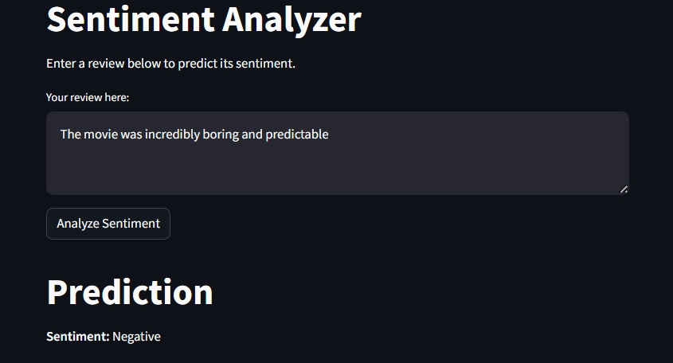
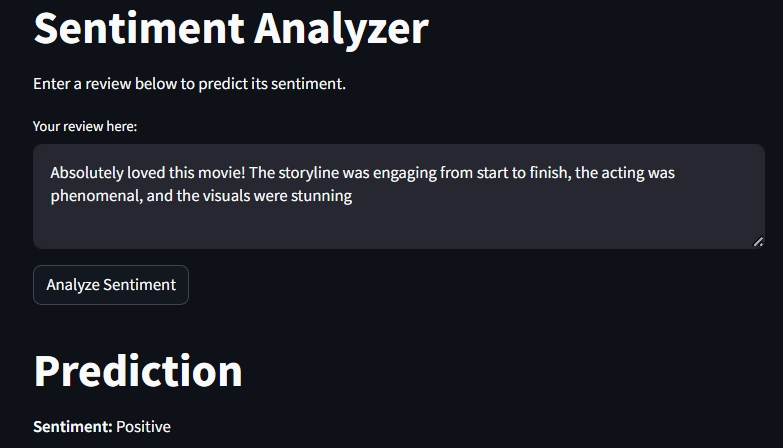

# IMDB Sentiment Analysis with LSTM and Web App

This project performs sentiment analysis on movie reviews from the IMDB dataset using an LSTM-based deep learning model. It also includes a web interface where users can input text and receive real-time sentiment predictions.

## Overview

- Trained on the IMDB dataset
- Uses an LSTM model for binary classification: **Positive** or **Negative**
- Deployed with a user-friendly web app interface built using Streamlit

## Tech Stack

- **Python**
- **TensorFlow/Keras** for LSTM
- **NumPy** for data handling
- **Streamlit** for web app

## Results

